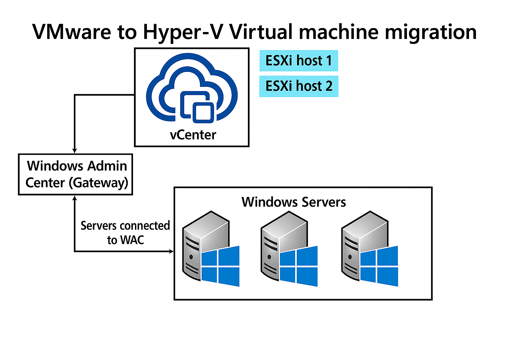
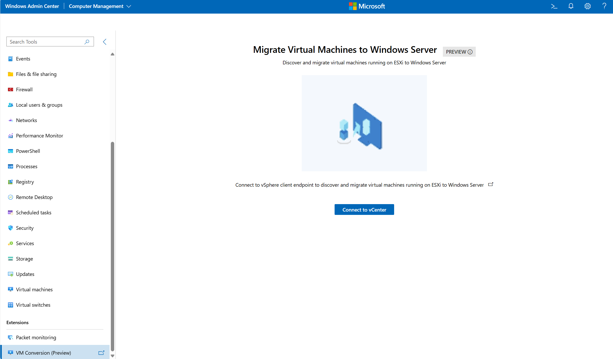

# Migrate VMware virtual machines to Hyper-V in Windows Admin Center (Preview)

> [!IMPORTANT]
> The VM Conversion extension is currently in PREVIEW.
> This information relates to a prerelease product that may be substantially modified before it's released. Microsoft makes no warranties, expressed or implied, with respect to the information provided here.

You can use Windows Admin Center to migrate VMware virtual machines from vCenter to Hyper-V with the **VM Conversion extension**. This lightweight solution enables seamless migration with minimal downtime for both Windows and Linux VMs.

In this article, you learn how to install and configure the extension, follow the migration workflow, and find answers to common questions.

The VM Conversion extension provides the following key features:

- **Live migration with minimal downtime**: Uses VMware CBT for seamless, low-disruption migration.
- **Windows & Linux VM support**: OS-agnostic migration from vCenter to Hyper-V.
- **No extra setup**: Built into Windows Admin Center—lightweight and agentless.
- **Smart auto-discovery**: Instantly detects VMs from connected vCenter environments.
- **Bulk & cluster-aware migration**: Migrate multiple VMs, including to clustered Hyper-V setups.
- **Post-migration management** Manage VMs directly within Windows Admin Center.

## Prerequisites

Before you begin, review the prerequisites and ensure your environment meets the requirements.

- Hyper-V is installed on Windows Admin Center gateway.

- PowerCLI is installed. Install using the PowerShell command: `Install-Module VMware.PowerCLI`

- [Microsoft Visual C++ Redistributable](/cpp/windows/latest-supported-vc-redist) is installed on machine with the Windows Admin Center gateway.

- [Visual C++ Redistributable Packages for Visual Studio 2013](https://www.microsoft.com/download/details.aspx?id=40784) is installed.

- [VMware Virtual Disk Development Kit (VDDK) version 8.0.3](https://developer.broadcom.com/sdks/vmware-virtual-disk-development-kit-vddk/latest/) is downloaded. Extract it, and copy the extracted contents to the directory: *C:\Program Files\WindowsAdminCenter\Service\VDDK*.

- Windows Admin Center Gateway V2 – GA version.

- VMware VCenter version 6.x or higher is installed. Keep the following vCenter information at hand:
  - Fully Qualified Domain Name (FQDN)
  - Username
  - Password

- Ensure that the VM to be migrated has no active snapshots. If snapshots exist, initial sync prechecks fail.

## Supported guest operating systems

The following operating systems can use the VM Conversion extension:

- Windows Server 2025, 2022, 2022 Azure Edition, 2016, 2012 R2
- Windows 10
- Alma Linux*
- Ubuntu 20.04, 24.04
- CentOS
- Red Hat Linux 9.0
- Debian 11, 12

*For Linux guests, Hyper-V drivers must be installed before initiating migration. This is essential to ensure successful post-migration boot.

## Install the VM Conversion extension in Windows Admin Center

Complete the following steps to install the **VM Conversion** extension.

1. Open Windows Admin Center.

1. Select the **Settings** button in the top-right. In the left pane, select **Extensions**.

1. The Available Extensions tab lists the extensions on the feed that are available for installation.

1. Search for **VM Conversion Extension** in **Available extensions** and select **Install.**

1. Once installed, ensure VM Conversion extension is visible in the Windows Admin Center under: **Extensions** > **VM Conversion**.

## Migrate virtual machines using the VM Conversion extension

Complete the following steps to migrate VMware virtual machines to Hyper-V in Windows Admin Center.

1. Connect to the Hyper-V server in Windows Admin Center that you want the VM to be migrated.

1. Go to the VM migration tool in the left panel under **Extensions** > **VM Conversion**.

1. Select **Connect to vCenter**.

    

1. Enter the vCenter FQDN, vCenter username, and vCenter password.

    

1. In the virtual machine list, select up to 10 virtual machines to synchronize.

    

1. Select **Synchronize**. In the Synchronize VM window, enter in the **path to store data**. Select **Synchronize**.

    

1. You see notifications appear with the progress for: prechecks, preparing the environment, snapshot creation, and finalizing synchronization. Confirm that the VHDX file is created in the folder path specified.

1. Wait for the sync to complete 100%.

    

1. Go to the **Migrate** tab, and select the VM to migrate. Select **Migrate**.

1. In the Migrate VM window, check the box if you want to **migrate the static IP address** for each VM. Select **Proceed** in the confirmation box to start the migration.

    During the migration, the following steps are performed: run migration prechecks, ensure sufficient disk space, perform delta replication, power off source VM, execute final delta sync, and import VM into Hyper-V.

    

1. Wait for virtual machine migration to complete. After the VM is migrated, the migration status shows **Destination VM created. Migration completed (100%).**

1. The migrated virtual machine can be managed using the Hyper-V Manager, or in Windows Admin Center.

## View logs

### Browser console logs

1. Open your browser settings, and navigate to **More Tools** > **Developer Tools**.
1. Check the **Console** tab.
1. Look for any error or warning messages and share them as needed.

### Event viewer logs

1. On the Windows Admin Center server, open **Event Viewer**.
1. Expand **Applications and Services Logs** in the left pane.
1. Select **WindowsAdminCenter**.
1. Filter and review logs for **Errors**, **Warnings**, and **Informational** messages relevant to the VM Conversion extension.

### VM conversion logs

1. Connect to the Windows Admin Center server.
1. Find the file located at `C:\ProgramFiles\WindowsAdminCenter\Service\VMConversion_log.txt`.

## Frequently asked questions

1. Can I migrate both Windows and Linux virtual machines?

    Yes—the tool supports migration of both Windows and Linux VMs. For Alma Linux, make sure Hyper-V drivers are installed before migration to ensure a smooth boot on the destination server.

1. Which VMware versions are supported?

    The tool supports vCenter and ESXi versions 6.x and higher.

1. Does the tool support both Static and DHCP IP addresses?

    Yes. DHCP and Static IP addresses works automatically; no manual action needed. For Static IP configuration of linux vms; Hyper-V drivers should be preinstalled using [Install Linux Integration Services (LIS) on Hyper-V VM](https://poweradm.com/install-linux-integration-services-hyper-v/).

1. How does the tool handle VM boot types?

    The tool automatically detects the source VM’s boot type. **BIOS boot** creates a Generation 1 VM on Hyper-V.**UEFI boot** creates a Generation 2 VM on Hyper-V.

1. What are the current limitations of this migration tool?

    The Resync option provides the capability to do data synchronization between initial replication and delta replication. The Resync option isn't supported. VMware Tools aren't automatically uninstalled post-migration—remove them manually if needed.

1. What should I know about the source VM before migrating?

    Ensure there are no active snapshots exist for the VM—the initial sync fails otherwise. You have the FQDN and credentials for your vCenter endpoint.

1. How to Create Network Shares on a Windows Server Cluster for Clustering Support?

    To create a network share on a clustered Windows Server (for VM synchronization or migration scenarios), follow these steps:
    1. RDP into your Windows Server Cluster node.
    1. Press Windows + R, type cluadmin.msc, and hit Enter. This opens the Failover Cluster Manager.
    1. In the left pane, expand your cluster and navigate to Roles.
    1. Follow the detailed steps in this [Setting up highly available file shares in Windows Server 2022](https://4sysops.com/archives/setting-up-highly-available-file-shares-in-windows-server-2022/)
    1. Sometimes, it may take a few minutes for the drive to become ready before it can be added as a network file share. Wait patiently if that happens.
    1. Once configured, the network share folder is ready for use in VM synchronization and migration workflows.

1. Why are migrated VM disks showing as Dynamic instead of Static (Fixed)?

    The VM Conversion tool currently migrates disks as **dynamically expanding (thin provisioned)** VHDX files, which means only the used portion of the disk is copied—not the full allocated size.

    During migration, a VM with a **provisioned size of 500 GB** but **actual usage of 250 GB** results in a 250 GB dynamic VHDX on the destination. While this is space-efficient, it may cause storage management issues later.

    After migration, customers should convert the VHDX to a fixed size to reflect the full provisioned storage: `Convert-VHD -Path "C:\VMs\MyDisk.vhdx" -DestinationPath "C:\VMs\MyDisk_Fixed.vhdx" -VHDType Fixed`.
