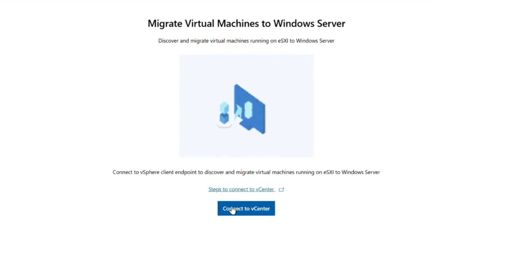

# Migrate a VMWare virtual machine to Hyper-V in Windows Admin Center

You can use Windows Admin Center (WAC) to migrate virtual machines (VMs) from VMware vCenter to Hyper-V. This article explains how to install and configure the VM Conversion extension, outlines the migration workflow, and provides troubleshooting tips. Before you begin, review the prerequisites and ensure your environment meets the requirements.

## Prerequisites

- Hyper-V is installed on WAC gateway.

- WAC Gateway V2 – GA version.

- VMWare VCenter version 7.x or above is installed. Keep handy the:
  - Fully Qualified Domain Name (FQDN) of vCenter endpoint
  - Login credentials of vCenter

- Install either [PowerCLI](https://techdocs.broadcom.com/us/en/vmware-cis/vcf/power-cli/latest/powercli/installing-vmware-vsphere-powercli/install-powercli.html) or [PowerCLI Offline](https://techdocs.broadcom.com/us/en/vmware-cis/vcf/power-cli/latest/powercli/installing-vmware-vsphere-powercli/install-powercli-offline.html)

- Install [Microsoft Visual C++ Redistributable](/cpp/windows/latest-supported-vc-redist) on machine where WAC
  gateway is installed.

- Download the latest [VMware Virtual Disk Development Kit (VDDK)](https://developer.broadcom.com/sdks/vmware-virtual-disk-development-kit-vddk/latest/), extract it, and copy the extracted contents to the following directory: *"C:\Program Files\WindowsAdminCenter\Service\VDDK"*.

## Install the extension

1. Download the extension provided in a local folder in WAC machine. (C:\Extension)

1. Open Windows Admin Center and navigate to the "Extensions" section.

1. Add the local directory to Feeds.

1. Search for **VM Conversion Extension** in **Available extensions** and click **Install.**

1. Once installed, ensure VM Conversion extension is visible in the WAC under: **Extensions** > **VM Migration**.

## Supported scenario topology

## Migrate a VM migration using the conversion extension

1. Connect to the Hyper-V server (**Datacenter-Server-001**) in WAC that you want the VM to be migrated.

1. Go to VM migration tool in the left panel under **Extensions** > **VM Migration**.

1. Select **Connect to vCenter**.

    

1. Enter the vCenter FQDN, vCenter username, and vCenter password.

    

1. Look up the virtual machine that needs to be migrated.

1. Select the Virtual machine (Windows/Linux) to migrate.

    

1. Click on **Synchronize**. In the Synchronize VM window, enter in the **path to store data**. Select **Synchronize**.
 
    

1. You see notifications appear with the synchronize progress. Confirm that the VHD file is created in the folder path specified.

1. Wait for the sync to complete 100%.

    

1. Go to **Migrate** tab, select the VM to migrate. Click **Migrate**. Select **Proceed** in the confirmation box. Delta replication is triggered. The virtual machine is briefly turned off during cut-over. The new virtual machine is created on the server **(Datacenter-Server-001)**.

    

1. Wait for virtual machine migration to complete.

1. The migrated virtual machine can be managed using the Hyper-V Manager, or in WAC.

## View logs

1. Open your browser settings, navigate to More Tools > Developer Tools. Check the Console tab. Share any error log statements you see there.

2. Open Event Viewer, expand Applications and Services Logs in the left pane. Select WindowsAdminCenter, and filter the logs to capture errors. Kindly share those details as well.

3. Share the file located at C:\ProgramFiles\WindowsAdminCenter\Service\VMConversion_log.txt file.

## Known limitations

- Currently only 1-VM migration at a time is supported.

- At-scale experience: work-in-progress

- Host networking settings do not persist from eSXI host to Hyper-V host

- VM Tools not uninstalled after VM is migrated. Feature is in roadmap.
