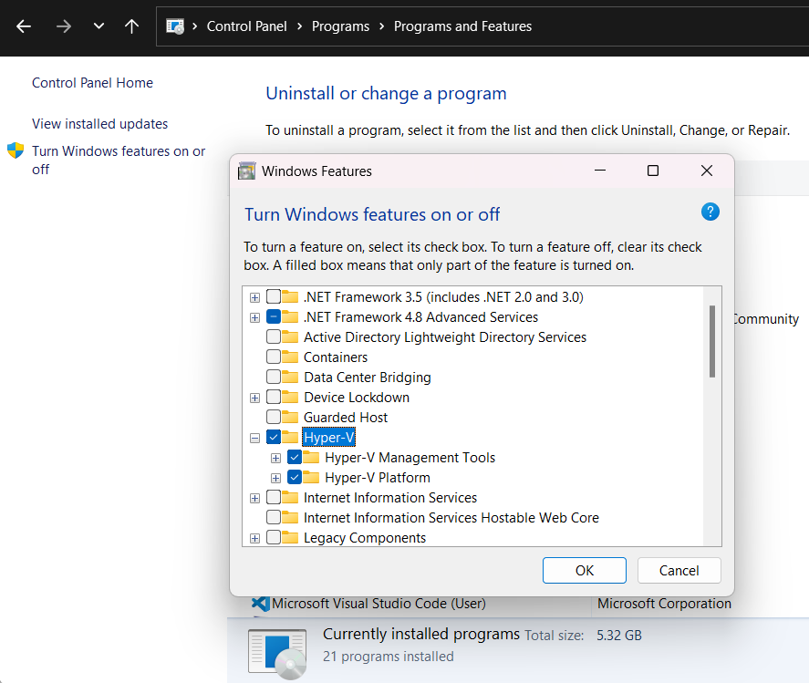

# Install Hyper-V

:::zone pivot="windows-server"

To create and run virtual machines, install the Hyper-V role on Windows Server by using Server Manager or the **Install-WindowsFeature** cmdlet in Windows PowerShell.

To learn more about Hyper-V, see the [Hyper-V Technology Overview](../Hyper-V-Technology-Overview.md). To learn more about Hyper-V, see the [Hyper-V Overview](../Hyper-V-Technology-Overview.md). To try out Windows Server 2025, you can download and install an evaluation copy. See the [Evaluation Center](https://www.microsoft.com/evalcenter/evaluate-windows-server-2025).

## Check requirements for Windows Server

Before you install Windows Server or add the Hyper-V role, make sure that:

- Your computer hardware is compatible. For more information, see [System Requirements for Windows Server](../../../get-started/hardware-requirements.md) and [System requirements for Hyper-V on Windows Server](../System-requirements-for-Hyper-V-on-Windows.md).

- You don't plan to use third-party virtualization apps that rely on the same processor features that Hyper-V requires. Examples include VMWare Workstation and VirtualBox. You can install Hyper-V without uninstalling these other apps. But, if you try to use them to manage virtual machines when the Hyper-V hypervisor is running, the virtual machines might not start or might run unreliably. For details and instructions for turning off the Hyper-V hypervisor if you need to use one of these apps, see [Virtualization applications don't work together with Hyper-V, Device Guard, and Credential Guard](https://support.microsoft.com/help/3204980/virtualization-applications-do-not-work-together-with-hyper-v-device-g).

If you want to install only the management tools, such as Hyper-V Manager, see [Remotely manage Hyper-V hosts with Hyper-V Manager](../Manage/Remotely-manage-Hyper-V-hosts.md).

## Install Hyper-V by using Server Manager

1. In **Server Manager**, on the **Manage** menu, select **Add Roles and Features**.

2. On the **Before you begin** page, verify that your destination server and network environment are prepared for the role and feature you want to install. Select **Next**.

3. On the **Select installation type** page, select **Role-based or feature-based installation**, and then select **Next**.

4. On the **Select destination server** page, select a server from the server pool, and then select **Next**.

5. On the **Select server roles** page, select **Hyper-V**. From the **Add Roles and Features Wizard** page, select **Add Features**, and then select **Next**.

6. On the **Select features** page, select **Next**, and then select **Next** again.

7. On the **Create Virtual Switches** page, **Virtual Machine Migration** page, and **Default Stores** page, select the options that suit your specific environment.

8. On the **Confirm installation selections** page, select **Restart the destination server automatically if required**, and then select **Install**.

9. When installation is finished, verify that Hyper-V installed correctly. Open the **All Servers** page in Server Manager and select a server on which you installed Hyper-V. Check the **Roles and Features** tile on the page for the selected server.

## Install Hyper-V by using the Install-WindowsFeature cmdlet

1. On the Windows desktop, select the Start button and type any part of the name **Windows PowerShell**.

2. Right-click Windows PowerShell and select **Run as Administrator**.

3. To install Hyper-V on a server you're connected to  remotely, run the following command and replace `<computer_name>` with the name of server.

    ```powershell
    Install-WindowsFeature -Name Hyper-V -ComputerName <computer_name> -IncludeManagementTools -Restart
    ```

    If you're connected locally to the server, run the command without `-ComputerName <computer_name>`.

4. After the server restarts, you can see that the Hyper-V role is installed and see what other roles and features are installed by running the following command:

    ```powershell
    Get-WindowsFeature -ComputerName <computer_name>
    ```

    If you're connected locally to the server, run the command without `-ComputerName <computer_name>`.

> [!NOTE]
> If you install this role on a server that runs the Server Core installation option of Windows Server 2016 and use the parameter `-IncludeManagementTools`, only the Hyper-V Module for Windows PowerShell is installed. You can use the GUI management tool, Hyper-V Manager, on another computer to remotely manage a Hyper-V host that runs on a Server Core installation. For instructions on connecting remotely, see [Remotely manage Hyper-V hosts with Hyper-V Manager](../Manage/Remotely-manage-Hyper-V-hosts.md).

## Additional references

- [Install-WindowsFeature](/powershell/module/servermanager/install-windowsfeature?view=windowsserver2022-ps&preserve-view=true)

::: zone-end

:::zone pivot="windows"

Enable Hyper-V to create virtual machines on Windows. Hyper-V can be enabled in many ways including using the Windows control panel, PowerShell or using the Deployment Imaging Servicing and Management tool (DISM). This document walks through each option.

>[!NOTE]
> Hyper-V is built into Windows as an optional feature -- there's no Hyper-V download.

## Check requirements for Windows

- Windows 10 (Pro or Enterprise), or Windows 11 (Pro or Enterprise)
- 64-bit Processor with Second Level Address Translation (SLAT).
- CPU support for VM Monitor Mode Extension (VT-c on Intel CPUs).
- Minimum of 4 GB memory.

>[!NOTE]
> The Hyper-V role **can't** be installed on Windows 10 Home or Windows 11 Home.

For more information and troubleshooting, see [Windows Hyper-V System Requirements](/virtualization/hyper-v-on-windows/reference/hyper-v-requirements).

## Enable Hyper-V using PowerShell

1. Open a PowerShell console as Administrator.

1. Run the following command:

  ```powershell
  Enable-WindowsOptionalFeature -Online -FeatureName Microsoft-Hyper-V -All
  ```

  If the command isn't found, make sure you're running PowerShell as Administrator.

1. When the installation completes, reboot.

## Enable Hyper-V with CMD and DISM

The Deployment Image Servicing and Management tool (DISM) helps configure Windows and Windows images. Among its many applications, DISM can enable Windows features while the operating system is running.

To enable the Hyper-V role using DISM:

1. Open up a PowerShell or CMD session as Administrator.

1. Type the following command:

  ```powershell
  DISM /Online /Enable-Feature /All /FeatureName:Microsoft-Hyper-V
  ```

  

For more information about DISM, see the [DISM Technical Reference](/windows-hardware/manufacture/desktop/dism-reference--deployment-image-servicing-and-management).

## Enable the Hyper-V role through Settings

1. Navigate to the Control Panel.

1. Select **Programs**, then **Programs and Features**.

1. Select **Turn Windows Features on or off**.

1. Select **Hyper-V** and then select **OK**.



When the installation completes you're prompted to restart your computer.

::: zone-end